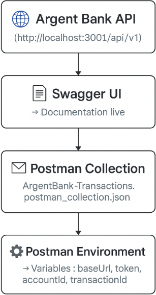

# Project #10 - Argent Bank API

This codebase contains the code needed to run the backend for Argent Bank.

## Getting Started

### Prerequisites

Argent Bank uses the following tech stack:

- [Node.js v12](https://nodejs.org/en/)
- [MongoDB Community Server](https://www.mongodb.com/try/download/community)

Please make sure you have the right versions and download both packages. You can verify this by using the following commands in your terminal:

```bash
# Check Node.js version
node --version

# Check Mongo version
mongo --version
```

### Instructions

1. Fork this repo
1. Clone the repo onto your computer
1. Open a terminal window in the cloned project
1. Run the following commands:

```bash
# Install dependencies
npm install

# Start local dev server
npm run dev:server

# Populate database with two users
npm run populate-db
```

Your server should now be running at http://locahost:3001 and you will now have two users in your MongoDB database!

## Populated Database Data

Once you run the `populate-db` script, you should have two users in your database:

### Tony Stark

- First Name: `Tony`
- Last Name: `Stark`
- Email: `tony@stark.com`
- Password: `password123`

### Steve Rogers

- First Name: `Steve`,
- Last Name: `Rogers`,
- Email: `steve@rogers.com`,
- Password: `password456`

## API Documentation

To learn more about how the API works, once you have started your local environment, you can visit: http://localhost:3001/api-docs

## Design Assets

Static HTML and CSS has been created for most of the site and is located in: `/designs`.

For some of the dynamic features, like toggling user editing, there is a mock-up for it in `/designs/wireframes/edit-user-name.png`.

And for the API model that you will be proposing for transactitons, the wireframe can be found in `/designs/wireframes/transactions.png`.

# 📨 Postman – Argent Bank

Ce dossier contient la **collection Postman**, l’**environnement** et le **schéma du workflow** pour tester l’API Argent Bank en local.

---

## 📦 Contenu du dossier

- **ArgentBank-Transactions.postman_collection.json**  
  → la collection Postman avec toutes les requêtes Transactions (GET, PATCH…).

- **ArgentBank-Local.postman_environment.json**  
  → l’environnement Postman avec les variables (URL locale, token de test, accountId…).

- **ArgentBank-Workflow.png**  
  → diagramme visuel du workflow API ↔ Swagger ↔ Postman.

---

## ⚙️ Import rapide dans Postman

1. Ouvrez Postman.
2. Cliquez sur **Import** → **Upload Files** → sélectionnez `ArgentBank-Transactions.postman_collection.json`.
3. Cliquez à nouveau sur **Import** → **Upload Files** → sélectionnez `ArgentBank-Local.postman_environment.json`.
4. Dans Postman, en haut à droite, choisissez **Argent Bank Local** comme environnement actif.

---

## 📝 Variables définies dans l’environnement

| Variable        | Valeur par défaut               | Description                     |
|-----------------|--------------------------------|---------------------------------|
| `baseUrl`       | `http://localhost:3001/api/v1` | URL de l’API                    |
| `token`         | `Bearer testtoken`             | JWT de test (à remplacer en prod)|
| `accountId`     | `acc1`                          | ID du compte par défaut         |
| `transactionId` | `tx1`                           | ID de transaction par défaut    |

Vous pouvez les modifier directement dans Postman si nécessaire.

---

## 🚀 Requêtes incluses

- **GET** `/accounts/{{accountId}}/transactions` — liste des transactions d’un compte.
- **GET** `/accounts/{{accountId}}/transactions/{{transactionId}}` — détail d’une transaction.
- **PATCH** `/accounts/{{accountId}}/transactions/{{transactionId}}/category` — mise à jour de la catégorie.
- **PATCH** `/accounts/{{accountId}}/transactions/{{transactionId}}/note` — mise à jour de la note.

---

## 📚 Swagger

Vous pouvez également consulter la documentation complète de l’API via Swagger :  
[http://localhost:3001/api-docs](http://localhost:3001/api-docs)

---

## 🗂 Workflow API / Swagger / Postman

<p align="center">
  
</p>

- **API** : votre serveur Express/MongoDB sur `http://localhost:3001/api/v1`.
- **Swagger UI** : documentation live sur `http://localhost:3001/api-docs`.
- **Postman Collection** : groupe les requêtes.
- **Postman Environment** : stocke URL, token, IDs.

---

### ✅ Résumé

- Ce dossier = collection + environnement + diagramme du workflow Postman.
- Import rapide → test immédiat de l’API.
- Variables modifiables selon vos besoins.
- Swagger UI pour explorer l’API.

